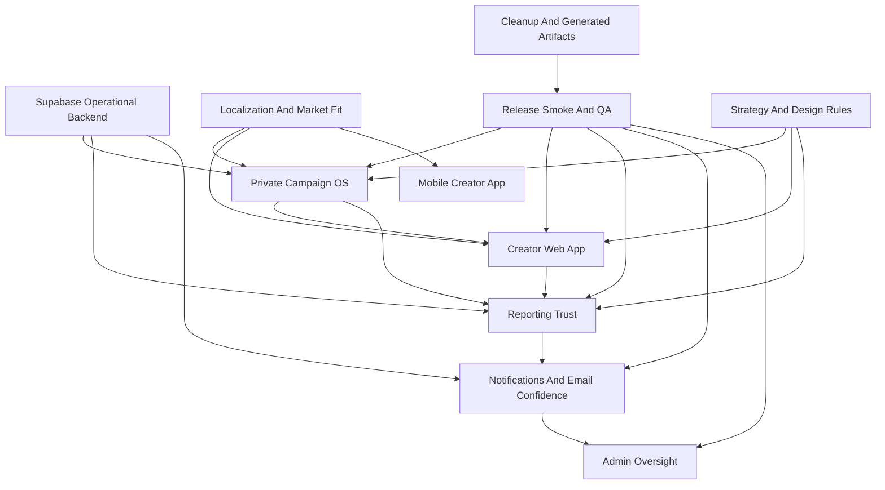

# Release Story Map

**Date:** 2026-05-16

**Purpose:** Convert the current broad working tree into reviewable product stories. This is not a feature wish list. It is the map we use to keep PopsDrops moving as one intentional product instead of a pile of small unrelated edits.

**Current inventory:** `git status --short` shows 368 entries in the working tree at the time of this scan: 196 modified, 147 untracked, and 25 deleted. Generated browser and email artifacts are treated as cleanup evidence, not product source stories.

## Story Review Order

1. Private Campaign OS
2. Reporting Trust
3. Notifications And Email Confidence
4. Admin Oversight
5. Creator Web App
6. Mobile Creator App
7. Localization And Market Fit
8. Supabase Operational Backend
9. Release Smoke And QA
10. Strategy And Design Rules
11. Cleanup And Generated Artifacts

## 1. Private Campaign OS

**Intent:** Make PopsDrops a private, invite-first campaign operating system. Brands bring the right creators, creators receive a clear handoff, and the platform manages the workflow without PopsDrops operating every campaign manually.

**Belongs here:**
- Brand campaign list, detail, builder, cockpit, and handoff surfaces.
- Public apply and creator preview continuity.
- Campaign assets, creative kit, rules, agreement gate, service packages, invite links, and market scope.
- Shared campaign types and validations.

**Representative paths:**
- `src/app/(site)/(app)/b/campaigns/**`
- `src/app/(site)/apply/[id]/**`
- `src/app/api/public/campaigns/[id]/route.ts`
- `src/components/campaigns/**`
- `src/lib/campaigns/**`
- `src/lib/campaign-service-packages.ts`
- `src/app/actions/campaign-agreements.ts`
- `src/app/actions/campaign-assets.ts`
- `shared/types.ts`
- `shared/validations.ts`

**Review standard:** Every brand-side field must affect one of five things: creator instructions, compliance, reporting, pricing, or campaign operations. If it does not, remove it or move it behind progressive disclosure.

**Proof path:** `npm run smoke:campaign-detail`, `npm run smoke:public-apply`, `npm run smoke:application-flow`, `npm run smoke:application-acceptance`, and in-app browser review on `/b/campaigns/new`, `/apply/[id]`, `/i/discover/[id]`.

## 2. Reporting Trust

**Intent:** Make reporting the trust layer. The brand report must be based on creator-submitted URL, proof, extracted metrics, manual confirmation, and brand review. No social account connection is required for the core reporting workflow.

**Belongs here:**
- Evidence-first reporting actions and tests.
- AI extraction from evidence files.
- Report correction, missed reports, late reports, verified evidence, and evidence history.
- Shared reports and export jobs.
- Campaign report charts and metric definitions.

**Representative paths:**
- `src/app/(site)/(app)/b/campaigns/[id]/report/**`
- `src/app/(site)/(app)/i/campaigns/[id]/report-task-flow.test.ts`
- `src/app/(site)/reports/share/[token]/**`
- `src/app/actions/reporting-evidence.ts`
- `src/app/actions/report-export-jobs.ts`
- `src/lib/reporting/**`
- `supabase/functions/analyze-performance-evidence/**`
- `supabase/functions/generate-report/**`
- `supabase/migrations/20260507193000_report_export_jobs.sql`

**Review standard:** Reports cannot hide uncertainty. A number should show where it came from, whether it was AI-extracted or manually confirmed, and whether the brand accepted it.

**Proof path:** `npm run smoke:content-report-workflow`, `npm run smoke:content-report-recovery`, `npm run smoke:content-report-late`, shared report route tests, export job tests, and in-app browser review of the report page.

## 3. Notifications And Email Confidence

**Intent:** Every important product event should have a reliable notification story: queue row, email template when needed, preference behavior, retry path, and admin visibility.

**Belongs here:**
- Notification queue state and audit.
- React Email templates and subject coverage.
- Notification preferences.
- Product event notifications: application rejected, new message, report correction, report follow-up, campaign completed.
- Admin communications retry and queue health.

**Representative paths:**
- `src/lib/email/**`
- `src/components/shared/notification-email-preferences-panel.tsx`
- `src/components/shared/notification-bell.tsx`
- `src/app/(site)/(app)/b/notifications/page.tsx`
- `src/app/(site)/(app)/i/notifications/page.tsx`
- `src/app/(site)/(app)/admin/communications/**`
- `src/lib/admin/notification-queue-health.ts`
- `scripts/notification-queue-audit.ts`
- `scripts/smoke-notification-*.ts*`
- `scripts/smoke-queue-backed-email-delivery.ts`
- `scripts/smoke-product-notification-actions.mjs`

**Review standard:** Raw emails are not acceptable product output. Email content, visual hierarchy, CTA, fallback text, and preference behavior must all be deliberate.

**Proof path:** `npm run smoke:notification-email`, `npm run smoke:notification-queue:audit`, `npm run smoke:notification-preferences`, `npm run smoke:report-correction-notification`, `npm run smoke:queue-backed-email`, `npm run smoke:product-notification-actions`, `npm run smoke:admin-communications-retry`.

## 4. Admin Oversight

**Intent:** Admin is a control tower, not a campaign operations team. It should help Max see risk, revenue, queue health, users, and concierge exceptions without implying PopsDrops runs every campaign by hand.

**Belongs here:**
- Admin layout, users, campaigns, analytics, audit, revenue, communications, settings.
- Campaign detail quality checks.
- Enterprise concierge exception pages and migrations.
- Admin table contracts and queue health.

**Representative paths:**
- `src/app/(site)/(app)/admin/**`
- `src/app/actions/admin.ts`
- `src/app/actions/admin-revenue-actions.test.ts`
- `src/components/admin-search.tsx`
- `src/lib/admin/**`
- `src/lib/supabase/enterprise-concierge-requests-migration.test.ts`
- `supabase/migrations/20260509110530_enterprise_concierge_requests.sql`
- `supabase/migrations/20260509124807_enterprise_concierge_quote_details.sql`

**Review standard:** Admin should surface exceptions and business health. Anything that implies daily human campaign management should be renamed, scoped to concierge exceptions, or removed.

**Proof path:** Admin table contract tests, admin communications smoke, and in-app browser desktop smoke for `/admin`, `/admin/communications`, `/admin/revenue`, and `/admin/campaigns/[id]`.

## 5. Creator Web App

**Intent:** Creator web should feel like a natural campaign room: find opportunity, understand the brief, accept rules, submit content, submit proof, track status, and know what happens next.

**Belongs here:**
- Creator home, discover, campaign room, campaign list, analytics, earnings, profile.
- Public invitation handoff into creator surfaces.
- Creator next-action logic and creator report submission state.

**Representative paths:**
- `src/app/(site)/(app)/i/**`
- `src/lib/campaigns/creator-room-next-action.ts`
- `src/lib/campaigns/creator-report-submission-state.ts`
- `src/lib/campaigns/creator-campaign-links.ts`
- `src/lib/creator-socials.test.ts`
- `scripts/smoke-creator-campaign.mjs`

**Review standard:** The creator should never wonder where to go next. One primary next action per state.

**Proof path:** `npm run smoke:creator-campaign`, creator discover/apply flow tests, creator campaign room tests, and mobile viewport in-app browser smoke.

## 6. Mobile Creator App

**Intent:** The Expo app should mirror the creator workflow with native ergonomics. Mobile is not a second product; it is the creator-first surface for the same campaign room.

**Belongs here:**
- Expo login and tabs.
- Campaign room and campaign detail.
- Mobile creator campaign data, preferences, waitlist, language selection, and NativeWind setup.
- Mobile generated bundles and icon generation.

**Representative paths:**
- `mobile/app/**`
- `mobile/components/**`
- `mobile/lib/**`
- `mobile/scripts/generate-icons.mjs`
- `mobile/tailwind.config.js`
- `mobile/store-metadata.md`

**Review standard:** Mobile creator surfaces may use intentional luxury dark styling. They still need the same product truth and validation as web.

**Proof path:** `npm run test:mobile`, `npm --prefix mobile run release:smoke` for mobile creator performance proof, `npm --prefix mobile run release:creator-proof:check` for Android and iOS proof artifacts, `npm --prefix mobile run release:preview:check` for the installable internal build lane, `npm --prefix mobile run build:preview:ios`, `npm --prefix mobile run build:preview:android`, `npm --prefix mobile run release:store-identity:check` for App Store Connect app ID and EAS secret handoff, `npm --prefix mobile run release:production-artifacts:check` so `--latest` points at finished iOS `.ipa` and Android `.aab` production artifacts, `npm --prefix mobile run release:store-visibility:check` after store submit to prove App Store Connect sees the iOS build and Play internal testing has the Android version code, `npm --prefix mobile run release:store-install-evidence:check` after real-device TestFlight and Play internal installs, `npm --prefix mobile run release:post-submit:check` as the combined post-submit release gate, and screenshot review for login, home, discover, campaign room, submit, and earnings. Store submission requires the `APPLE_ASC_API_KEY` and `GOOGLE_SERVICE_ACCOUNT` EAS file secrets before `npm --prefix mobile run release:submit:check` can pass.

## 7. Localization And Market Fit

**Intent:** PopsDrops is global. Campaigns can be presented in the market language, and platform UI uses bundled translations. Market scope supports Global, regions, and ISO markets without turning the product into a geography-specific platform.

**Belongs here:**
- Localized route relocation.
- Generated public and platform bundles.
- Locale server/client helpers.
- Market selection copy and ISO/region behavior.
- Campaign language and translation boundaries.

**Representative paths:**
- `src/app/(localized)/[locale]/**`
- deleted legacy `src/app/[locale]/**`
- `src/lib/i18n/**`
- `mobile/lib/generated/mobile-bundles/**`
- `src/lib/iso-markets.test.ts`
- `supabase/functions/translate-brief/**`
- `supabase/migrations/015_seed_brief_translations.sql`

**Review standard:** Fixed UI copy is bundled. Dynamic campaign content can use runtime translation. Platform names and metric acronyms stay stable.

**Proof path:** i18n platform bundle tests, route layout contract tests, mobile language tests, and in-app browser smoke for localized marketing pages.

## 8. Supabase Operational Backend

**Intent:** Supabase owns operational backend work: Postgres, RLS, Storage, Edge Functions, report generation, evidence extraction, dynamic translation, email dispatch, and lifecycle data. Next.js stays the product interface and thin orchestration layer.

**Belongs here:**
- Migrations, RLS, seed data, Supabase config.
- Edge Functions and shared function helpers.
- Removal of social OAuth, cron, token refresh, and dormant platform sync paths.
- Browser auth lock and migration contract tests.

**Representative paths:**
- `supabase/config.toml`
- `supabase/migrations/**`
- `supabase/functions/**`
- `src/lib/supabase/**`
- deleted `src/lib/oauth/**`
- deleted `src/app/api/cron/**`
- deleted `src/app/auth/social/**`
- `src/proxy.ts`
- deleted `src/middleware.ts`

**Review standard:** Do not preserve dead scaffolding. If a backend path does not serve the evidence-first campaign workflow, remove it or quarantine it as future work outside runtime.

**Proof path:** Supabase migration tests, RLS/advisor review, function smoke where safe, and `npm run smoke:release`.

## 9. Release Smoke And QA

**Intent:** Make the product prove itself repeatedly. A release is not ready until the important brand-to-creator-to-report loop can be run as one command.

**Belongs here:**
- Smoke scripts and tests.
- Release smoke command.
- Dev login smoke.
- Browser screenshots used as evidence.
- Test helpers that create and clean smoke data.

**Representative paths:**
- `package.json`
- `scripts/release-smoke-matrix.test.ts`
- `scripts/smoke-*.mjs`
- `scripts/smoke-*.ts`
- `scripts/smoke-*.tsx`
- `src/app/(site)/dev/login/**`
- `src/lib/dev-users.ts`

**Review standard:** Smoke scripts must be one-command by default. Fixture helper modes are allowed, but package scripts cannot require tribal knowledge.

**Proof path:** `npm run smoke:release`, including `npm run smoke:release-bad-paths` and the 100-creator payment spine, `npm --prefix mobile run release:smoke`, focused smoke tests, `npm run typecheck`, `npm run lint`, and `npm run build`.

## 10. Strategy And Design Rules

**Intent:** Keep product thinking and design rules explicit so future implementation does not drift. This is where the product stance lives: global, private, self-serve, premium, evidence-first, and intentional.

**Belongs here:**
- AGENTS, CLAUDE, DESIGN, SPEC.
- Research documents.
- Superpowers implementation plans.
- Rules like no decorative zap/sparkle icons, no em dashes, compact helper actions, aligned metrics, and no dead-end placeholder pages.

**Representative paths:**
- `AGENTS.md`
- `CLAUDE.md`
- `DESIGN.md`
- `docs/SPEC.md`
- `docs/research/**`
- `docs/superpowers/plans/**`

**Review standard:** Strategy docs must settle decisions, not preserve every brainstorm. If a decision has changed, update the canonical doc and remove contradictory guidance.

**Proof path:** Document diff review plus `git diff --check`.

## 11. Cleanup And Generated Artifacts

**Intent:** Keep the repo reviewable. Smoke screenshots, Playwright snapshots, email previews, and exported reports are valuable evidence, but they should not muddy source review unless deliberately kept.

**Belongs here:**
- Browser screenshots and generated export files.
- Playwright CLI console/page captures.
- `.env.local.example` files and Codex environment helpers.
- Deleted legacy setup docs if superseded.

**Representative paths:**
- `output/**`
- `.playwright-cli/**`
- `.env.local.example`
- `mobile/.env.local.example`
- `.codex/**`
- `script/dev-web.sh`
- `script/dev-mobile-web.sh`
- deleted `PLATFORM_SETUP.md`

**Review standard:** Keep final screenshots only when they are useful release evidence. Remove stale, duplicate, or exploratory artifacts before staging.

**Proof path:** `git clean -ndX` and `git status --short` review before staging. Do not delete artifacts blindly because some are intentional smoke evidence.

## Dependency Map

## What Gets Reviewed Together

**Review batch 1:** Release Smoke And QA, Cleanup And Generated Artifacts.

This makes the rest of the review possible. Remove obvious generated noise, keep only useful smoke evidence, and preserve the one-command release smoke.

Status: Completed on 2026-05-16 in `docs/superpowers/plans/2026-05-16-review-batch-1-cleanup.md`. Generated smoke artifacts are ignored, and `npm run smoke:release` passed afterward.

**Review batch 2:** Private Campaign OS, Creator Web App, Reporting Trust.

This is the core customer story: brand creates/invites, creator joins/executes, brand receives proof and report.

Status: Completed on 2026-05-16 in `docs/superpowers/plans/2026-05-16-review-batch-2-core-loop.md`. Closeout is locked to monitoring campaigns, creator room attention states are calm when no action is waiting, and the brand/detail/report/creator smoke paths passed.

**Review batch 3:** Notifications And Email Confidence, Admin Oversight.

This is the trust and operations story: every important event reaches the right person and admin sees failures.

Status: Completed on 2026-05-16 in `docs/superpowers/plans/2026-05-16-review-batch-3-notifications-admin.md`. Admin communications now separates active blockers from historical notification volume, notification/email smoke paths passed, and `npm run smoke:release` passed afterward.

**Review batch 4:** Supabase Operational Backend, Localization And Market Fit, Mobile Creator App.

This is the scale story: correct backend boundary, global language support, and creator-native mobile.

Status: Completed on 2026-05-16 in `docs/superpowers/plans/2026-05-16-review-batch-4-scale-global-mobile.md`. Mobile auth sessions now use SecureStore, mobile audit is clean, stale cron secrets are removed from CI, Expo Doctor is clean, localized marketing routes passed in-app browser smoke, and the remaining release smoke components passed.

**Review batch 5:** Strategy And Design Rules.

This keeps the canonical decisions clean after code reality settles.

Status: Completed on 2026-05-16 in `docs/superpowers/plans/2026-05-16-review-batch-5-strategy-design-rules.md`. Canonical docs no longer preserve MVP framing, social account sync as a default path, fixed mobile timing, or Supabase-dashboard-as-admin guidance. Design contract tests now enforce those strategy boundaries alongside existing icon, em dash, and report helper-action rules.

**Review batch 6:** Cleanup And Generated Artifacts, Release Smoke And QA recheck.

This closes the review hygiene pass: keep useful smoke evidence, remove scratch capture clutter, and make the release smoke less brittle without weakening product coverage.

Status: Completed on 2026-05-16 in `docs/superpowers/plans/2026-05-16-review-batch-6-final-cleanup-release-smoke.md`. `.playwright-cli/` scratch output was removed, `output/` was kept as ignored release evidence, browser dev-login smoke waits now retry with useful failure state, and `npm run smoke:release` passed afterward.

## Immediate Next Step

Move to **story-based staging and final review packaging**. The product stories have been reviewed in order, and the full release smoke is green. Stage by review batch instead of staging the entire broad working tree at once.
